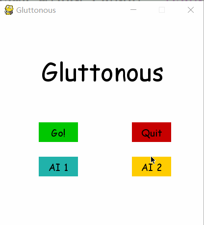

# Gluttonous snake AI 

## Requirements
- Python 3
- pygame
- [TensorFlow](https://github.com/tensorflow/tensorflow)

## Usage
To start the game or AI

	$ python gluttonous_snake.py
	
To train a model for deep q learning:
	$ python DQN.py
	
## Example
AI 1: use BFS and DFS to find a path

AI 2: use deep q learning

	